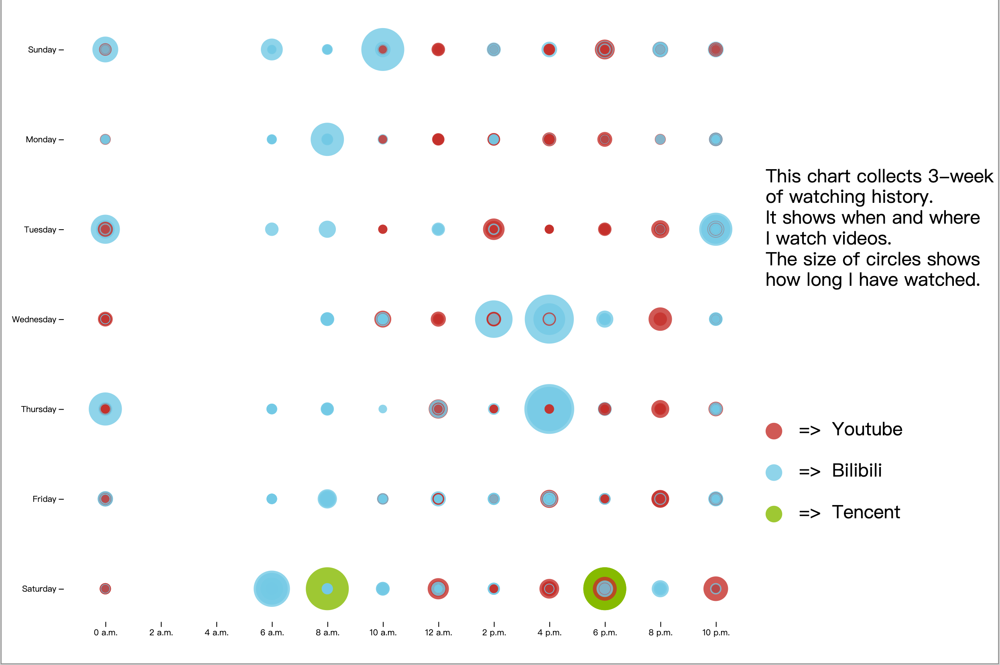
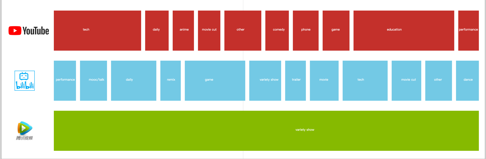
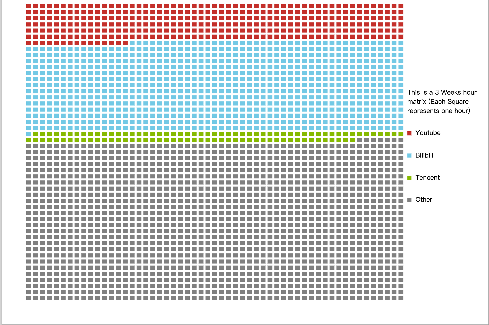

# Data Zine

## Brief

This is my Data zine which collects the past 4 weeks' video data (including when and from what platform do I watch and how long it is).

## Front 

Above is the fisrt page, it shows when and where I watch a video. The size of the circle is how long I have watched and the color of the circle indicate where do I watch.

## Middle

The middle page shows what type of videos I have watched on different platforms. And the size of each block represent the cooresponding percentage.

## Back

This page shows how long I have watched compared during the 4 weeks. Each block represent 1 hour and different colors fit into different categories.